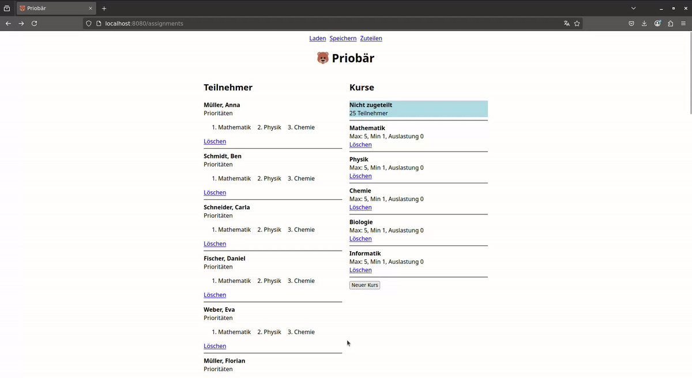

# Priobär
*Priobär is a web-based application that calculates optimal assignments of participants to courses based on their stated priorities.*



This is a learning project for me to 
- improve my ability to design and build complete systems.
- play around with different technologies and concepts.
- make my own mistakes and learn from them.

## Running Project Locally (for Development)
Currently only Linux is supported.

The project uses z3 for solving "optimal" assignments. You have to build z3 first. To do that navigate to `internal/z3` and execute:
```sh
make
```

After that you can define the required environment variables (for example via `source .dev-linux.env`) and finally run:
```sh
go run ./cmd/server
```

*Hint: the `.dev-linux.env` defines a directory for sqlite db-files ad `./db`. Make sure that directory exists if you use the `.env` file*

## Design & Concepts
This section documents some of the project's key concepts.

### Solving Algorithm
For finding an "optimal" assignments we employ the SMT-Solver Z3.

We can define the requirements for assignments as arithmetic or boolean constraints (e.g. a participant should be in exactly one course, courses should respect their minimum & maximium capacity). We can also define an objective function that should be maximized. For example we could score each created assignment based on the respective priority and then formulate a function that sums all scores obtained by created assignments. Z3 can find a solution for our problem instance so that all constraints are met and the objective function has the maximum possible result.

In theory this problem in NP-hard, but in practice Z3 will be able to calculate solutions for medium sized instances (N ~= 1000) in acceptable time.

### Per session database
This project was designed for the possibility of me actually operating this application. This means that it has to be GDPR-compliant. Also, since this is a side-project and not my day job, I wanted to keep maintenance effort and responsiblity for customer data to a minimum.
Therefore the application handles data persistence in the following way:

A user visiting the webpage is assigned as session token (if they do not have one already). The session maps to exactly one sqlite-database, which persist all data of this session. The database will be removed, at the same time as the session expires. Users are responsible for persisting their data between session. They can do that by loading/saving their data from/into excel-files. User data will not be permanently stored on the server. Also no account or dedicated login is necessary.

### Architecture & Package Structure
This project began with a straightforward Model-View-Controller (MVC) architecture, which allowed for quick feature development while avoiding premature abstractions.
However, as the project grew, some limitations of this approach became noticeable. Mainly, the code base lacked a clear separation between persistence and domain logic. Controller functions became increasingly complex, and (G)ORM implementation details began to leak into other layers of the application.

To address this, I’m currently refactoring the codebase toward a Domain-Driven Design-inspired structure, organized into UI, Application, Domain, and Infrastructure layers. The `domain` package is already partially in place, but infrastructure-related code remains in the model package for now, until a dedicated `infra` package is introduced.

As this transition is ongoing, you’ll find elements of both architectures coexisting. In particular, the `model` package still contains logic that should eventually move to either the `domain` or the future `infra` package.

## Current Status & TODOs

### Implemented Features
- Create, view, and delete participants, courses, and their priority links.
- Drag & drop assignment of participants to courses.
- Compute an optimal assignment configuration based on course capacities and participant priorities.
- Import/export data as Excel files.

### Known Limitations
- Web component for editing priorities is a rough proof-of-concept and hard to use.
- Some tests related to DB expiration are brittle. I believe due to an inappriopriate time-mocking approach.

### Planned Improvements
- Introduce a session keep-alive/renew mechanism for long-term use.
